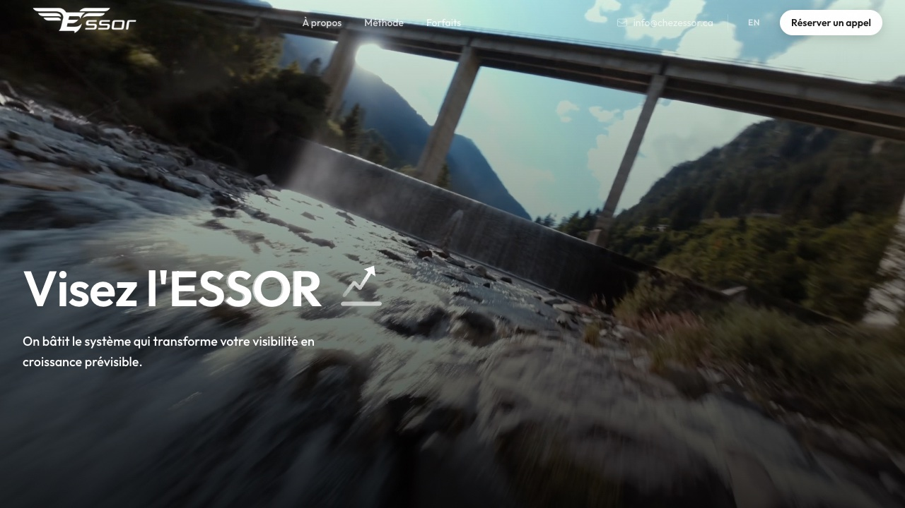

```text
┌── agustin@lab ~ $ whoami ──────┐
│ agustinpabon                   │
└────────────────────────────────┘
```

# Agustín Pabón

**Software Development · Applied AI · Cybersecurity**

[SYSMOTIX](https://sysmotix.com/en) · [Contact](mailto:agustinpabonlaure@gmail.com)

I am a software developer and M.Sc. student in Computer Science at Université Laval, based in Québec City, Canada.

My work combines full-stack product development with applied AI and cybersecurity research. At [SYSMOTIX](https://sysmotix.com/en), I build web applications and private software products. In my engineering workflow, I prioritize clear architecture, reproducible experiments, automated testing, and software that remains straightforward to maintain over time.

---

## Selected Client Work

Web development delivered through [SYSMOTIX](https://sysmotix.com/en).

### MADUC Construction

Website development for a residential renovation company.

[](https://maducconstruction.com/)

[Visit website](https://maducconstruction.com/) · Live website

---

### ESSOR

Website development for a video and advertising business.

[](https://chezessor.ca/)

[Visit website](https://chezessor.ca/) · Live website

---

## Public Projects & Open Source

- **[Telemetry Court](https://github.com/agustinpabon/Telemetry-court)**<br>
  Evidence-based human-in-the-loop AI validation bench for telemetry cluster interpretations.<br>
  Status: Public · Prototype

- **[World Cup Simulator](https://github.com/agustinpabon/fifa-world-cup-2026-simulator)**<br>
  Probabilistic modeling and tournament simulation.<br>
  Status: Public

- **[Toponymy · Tutte Institute](https://github.com/TutteInstitute/toponymy)**<br>
  Contributed a clustering integration and focused tests.<br>
  [PR #156 — Merged](https://github.com/TutteInstitute/toponymy/pull/156)

---

## Private Development

| Area | Focus | Availability | Status |
| :--- | :--- | :--- | :--- |
| **Applied AI research** | Research software and reproducible experimentation. | Private repository | Research |
| **Web & mobile products** | Cross-platform application development. | Private repository | In development |
| **Business software** | Internal tools and operational workflows. | Private repository | In development |

Selected private work is described at a high level; source code is not publicly available.

---

## Technologies


Also working with: JavaScript, C++, SQL, Bash, Tailwind CSS, PyTorch, Linux, Git.

---

**Québec City, Canada** · Spanish / French / English<br>
[SYSMOTIX](https://sysmotix.com/en) · [Contact](mailto:agustinpabonlaure@gmail.com)
